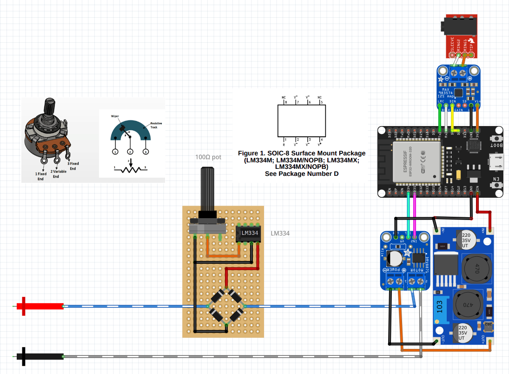

# TriSynchrony Core (WIP)
**Open-Source Electrotactile Sync Platform**

TriSynchrony is a hardware and software development kit designed to synchronize low-latency audio events with precise electrotactile haptic feedback and visual LED cues.

⚠️ **STATUS: WORK IN PROGRESS (WIP)**
This project is currently in early active development. We are translating our breadboard prototypes into formal schematics and documenting the ESP32 firmware. 

## Initial Hardware Sketch (Breadboard Prototype)
Below is the initial concept wiring focusing on the electrotactile driver and I2S audio output.
*(The system uses a Boost Converter and an LM334 constant current source, combined with an H-Bridge module, to generate safe, biphasic haptic pulses synchronized with the I2S audio stream).*

> **📝 Note on Visual Sync / Schematic Clarity:** > For visual clarity, this specific breadboard diagram omits the standard LED output wiring. The visual synchronization component of TriSynchrony simply utilizes a direct GPIO pin (e.g., GPIO 2 or 4) connected to an external LED and a 220Ω resistor. This allows the ESP32 to trigger light flashes in parallel with the audio/haptic outputs.

### Bill of Materials (BOM) - Prototype v0.1:
* **Microcontroller:** ESP32-WROOM-32D Development Board
* **Audio Output:** MAX98357A I2S Class D Amplifier + 3.5mm Audio Jack
* **Polarity Switching:** DRV8871 H-Bridge Motor Driver
* **Power Delivery:** DC-DC Boost Converter Module
* **Current Regulation:** LM334 Constant Current Source + Diode Bridge Rectifier
* **Calibration:** 100Ω Potentiometer (Hardware skin-resistance gain control)
* **Visual Output:** Standard 5mm LED + 220Ω Resistor (Not pictured)

## Next Steps
* [ ] Release complete KiCad/EasyEDA schematics (including LED routing)
* [ ] Upload core ESP32 firmware (PWM, I2S, and GPIO sync logic)
* [ ] Publish Web UI configuration tool

---
⚠️ **Hardware Safety Disclaimer:** TriSynchrony is an open-source DIY hardware project. Building circuits that output electrical current (electrotactile feedback) involves inherent safety risks. Do not use electrotactile devices near the chest, across the head, or if you have a pacemaker or heart condition. The creators provide these schematics and code "AS-IS" for educational, maker, and experimental use only. Anyone assembling, modifying, or using this hardware assumes full responsibility for their own electrical isolation, testing, and personal safety.
